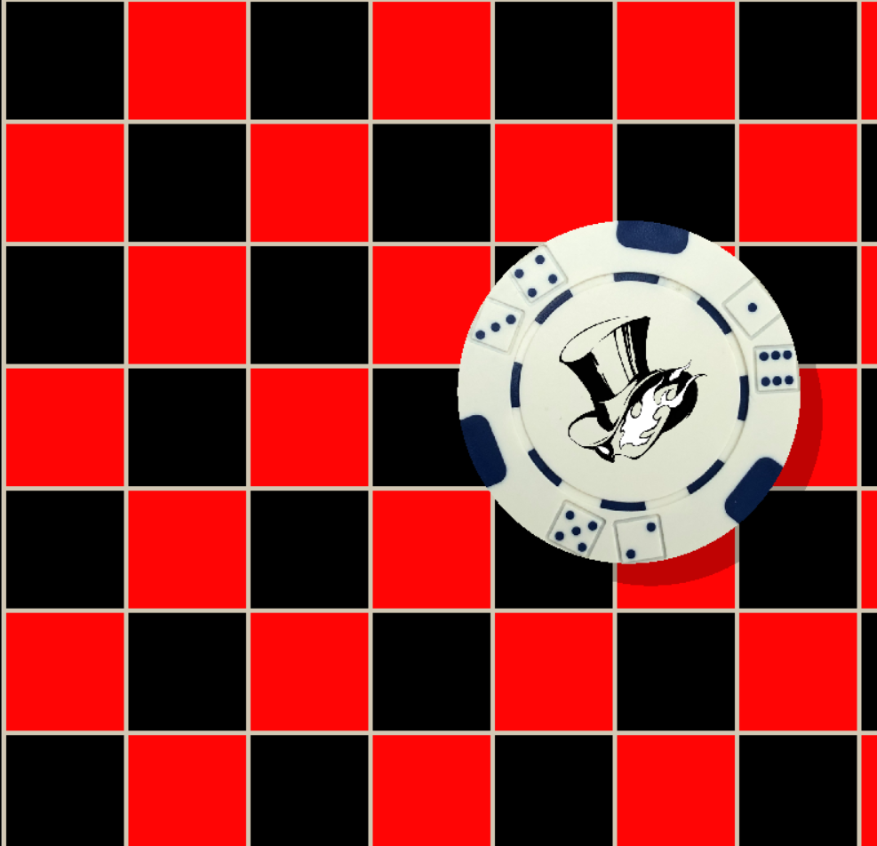
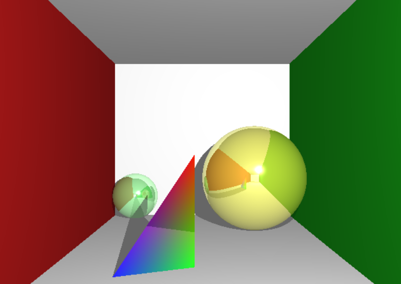
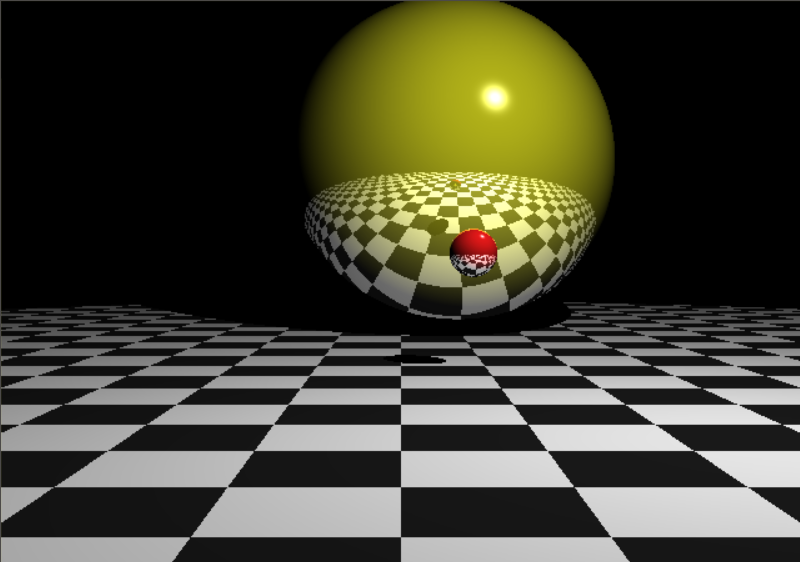
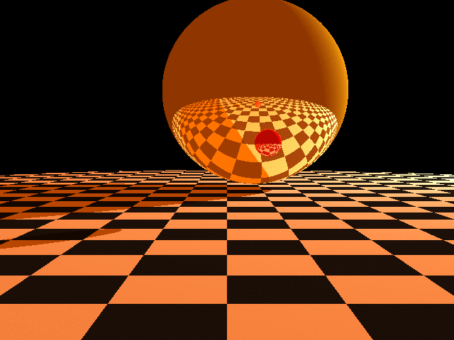

# OpenGL-Projects
 A sample of OpenGL projects

## Cloth and Springs
The following is a an example of X11 programming in a UNIX environment.
The video is a simulation of springs and cloth using C++ and X11 libraries.

## Pixels on a screen
The following is a screen capture of pixels on a screen rendering a checkerboard
as well as an image of a poker chip with soft shadowing. This was also built
using X11 libraries and C++. 

The second image is an image of a sky using the same method as the checkerboard
project and applying Perlin Noise.

## Ray Tracer
The following are samples of scenes rendered on a simple ray tracer
using OpenGL and C++.

### Cornell Box

### Ray Tracer

### Animation

## texture Mapping
The following is a video of a texture mapped box using 
OpenGL and C++.

## License
[MIT](https://choosealicense.com/licenses/mit/)